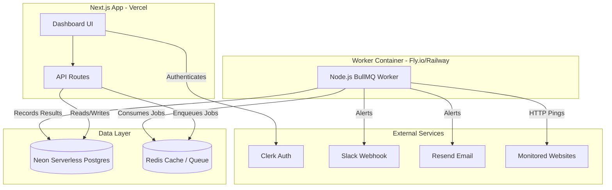

# Uptime Monitor

[](https://github.com/themzaid/uptime-app/actions/workflows/lint.yml)
[](https://github.com/themzaid/uptime-app/actions/workflows/test.yml)

A full-stack, production-ready Next.js application that monitors your websites via ping intervals, detects incidents, and alerts you via Slack and Email when they go down.

## Tech Stack
- **Frontend/Framework:** Next.js 15 (App Router), Tailwind CSS v4, Tremor (Charts)
- **Database:** Neon Serverless Postgres, Drizzle ORM
- **Background Jobs:** BullMQ, Redis (for scheduled pings and retries)
- **Authentication:** Clerk
- **Emails & Alerts:** Resend (Email), Slack Webhooks
- **Package Manager:** pnpm

## Architecture



## Local Development Setup

Follow these steps to get the full stack running locally.

### 1. Clone & Install Dependencies
```bash
git clone https://github.com/themzaid/uptime-app.git
cd uptime-app
pnpm install --ignore-scripts
```

### 2. Configure Environment Variables
Copy `.env.example` to create your local environment files:
```bash
cp .env.example .env.local
cp .env.example .env.e2e
```
*Note: You must fill in the Clerk API keys, Database URLs, and Slack webhook URLs inside `.env.local`.*

### 3. Start Database and Redis
The application requires PostgreSQL and Redis. You can easily spin them up using the provided Docker Compose file:
```bash
docker compose up -d postgres redis
```
Once running, push your database schema to the local Postgres instance:
```bash
pnpm db:push
```

### 4. Start the Application
You need to run both the Next.js dashboard and the background worker simultaneously:

Terminal 1 (Next.js Dashboard):
```bash
pnpm dev
```

Terminal 2 (BullMQ Worker):
```bash
pnpm run worker
```
The dashboard will be available at [http://localhost:3000](http://localhost:3000).

## Testing
- **Unit Tests:** `pnpm test run` (Powered by Vitest)
- **E2E Tests:** `pnpm exec playwright test` (Requires local server and database to be running)

## CI/CD Pipeline

This repository uses GitHub Actions for continuous integration and deployment:

- **Lint and Typecheck:** Runs ESLint and TypeScript checks on PRs and pushes to `main`.
- **Automated Tests:** Runs Vitest and Playwright tests against an ephemeral Dockerized database environment on every PR.
- **Worker Image Publish:** Builds and publishes the Node.js worker Docker image to GitHub Container Registry (GHCR) when merged to `main`.
- **Dashboard Deployment:** The frontend dashboard is automatically deployed to Vercel on push to `main`.
- **Worker Deployment:** The backend polling worker is automatically deployed to Fly.io/Railway via Docker image.
